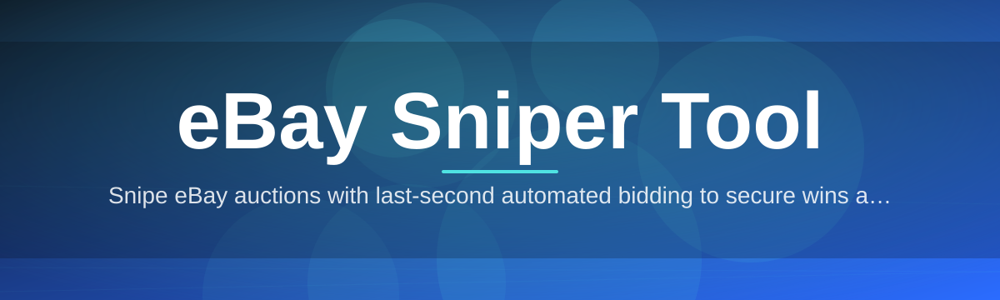
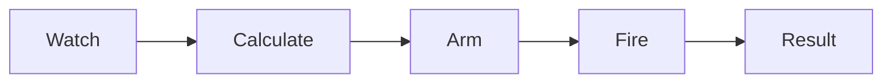

# ebay-sniper-tool 🎯⏱️

  

*Place your final bid at the exact right millisecond — every single time.*

  

---

## ⚡ Quick Start

> [!TIP]
> Already know the drill? Three steps and you're bidding.

1. **Grab the app** from the landing page (button below).

2. **Launch** `ebay-sniper-tool.exe` — no setup wizard, no dependencies.

3. **Paste an item URL**, set your max bid and timing offset, hit **Arm**.

---

## 🔭 Overview

`ebay-sniper-tool` is a purpose-built Windows companion for competitive eBay bidding. Auctions on eBay resolve in their final seconds — a window where manual refreshing and human reaction time simply can't compete with automated, precisely-timed bid placement. This project exists to close that gap: it schedules your maximum bid to land in the closing moments of an auction, giving you the timing edge that separates "won" from "outbid."

The tool is built for collectors, resellers, refurbishers, and anyone who has ever lost an item by three seconds and a fumbled tab switch. It doesn't replace your judgment on value or condition — it replaces the tedious, error-prone act of babysitting a countdown clock. You decide the ceiling price; the scheduler handles the clock.

Under the hood, this is a lightweight, standalone desktop utility — not a browser extension, not a cloud service you have to trust with your credentials. Your bidding logic, timing offsets, and watchlists live locally on your machine, executed through a fast, predictable engine designed around one job: firing your bid at the moment you chose, reliably.

## 📥 Download

---

## 🧭 What It Actually Does

- **Countdown Precision Bidding** — schedules your bid to submit at a custom offset (down to sub-second) before auction close, not "sometime near the end."

- **Multi-Auction Watchlist** — queue dozens of eBay listings simultaneously; each gets its own bid ceiling and timing profile.

- **Max-Bid Ceiling Lock** — set a hard cap per item so you never overpay chasing a bidding war in the heat of the moment.

- **Live Auction Telemetry** — a real-time panel showing current price, bid count, and time-to-close for every tracked listing.

- **Local Session Vault** — your login session and watchlists are stored on-device, encrypted at rest, never synced to a third-party server.

- **Snipe History Log** — a searchable ledger of every scheduled bid, outcome, and final price, so you can audit your own bidding patterns.

- **Network Jitter Compensation** — the scheduler adjusts fire-time based on measured round-trip latency to your connection, not a fixed guess.

- **Multi-Account Profiles** — switch between separate eBay identities without cross-contaminating watchlists or history.

  

---

## 🚀 Getting Started, Step by Step

> [!NOTE]
> The tool ships as a single portable executable. No installer, no registry writes, no background services.

1. Visit the landing page via the download button on this page.

2. Download the latest `ebay-sniper-tool` package for your Windows build.

3. Run the executable — Windows may show a SmartScreen prompt for unsigned apps; click **More Info → Run Anyway**.

4. Sign in with your eBay account inside the app, add your first listing URL, and set your snipe offset.

---

## 🖥️ System Requirements

| Component | Minimum | Recommended |
|---|---|---|
| **OS** | Windows 10 (64-bit) | Windows 11 (64-bit) |
| **RAM** | 2 GB | 4 GB+ |
| **Disk** | 150 MB free | 300 MB free |

> [!IMPORTANT]
> No third-party runtimes required. No package managers. No terminal commands. Download, run, bid.

---

## ⚙️ How It Works

The engine runs on a simple four-stage loop: it watches, calculates, waits, and fires.

1. **Track** — the app polls eBay's public listing pages for price and time-remaining data.

2. **Calculate** — using your chosen offset and measured latency, it computes the exact fire timestamp.

3. **Arm** — the bid payload is pre-built and held in memory, ready to submit instantly.

4. **Fire** — at T-minus-offset, the bid is submitted with zero manual interaction.

5. **Log** — the outcome (won/outbid/error) is written to your local snipe history.

---

## 🧩 Troubleshooting

<strong>My bid didn't submit — what happened?</strong>

Check the Snipe History log for an error code. The most common cause is the item ending early via Buy It Now, or eBay's own bid increment rules blocking your ceiling as too low.

<strong>The countdown timer looks off by a few seconds.</strong>

That's usually clock drift between your machine and eBay's servers. Enable **Auto-Sync Clock** in Settings so the app recalibrates against server time on each refresh.

<strong>Windows SmartScreen is blocking the app.</strong>

This is expected for independently distributed executables. Click **More Info → Run Anyway**. The binary is unsigned but unmodified from the landing-page release.

<strong>Can I snipe multiple items ending at the same second?</strong>

Yes. The scheduler runs each armed bid on its own thread, so simultaneous auction closes don't block one another.

<strong>Why didn't my max bid actually get used in full?</strong>

eBay's proxy bidding system only raises your bid to beat the current second-highest bidder by the minimum increment — you're never charged your full ceiling unless another bidder pushes it there.

> [!WARNING]
> Sniping does not guarantee a win. If your ceiling is below another bidder's max, the auction will resolve against you regardless of timing.

---

## 🎨 UI & UX Details

- **Themes** — Light, Dark, and a high-contrast "Auction Night" mode for late-session bidding.

- **Keyboard Shortcuts**:

  | Shortcut | Action |
  |---|---|
  | `Ctrl + N` | Add new listing to watchlist |
  | `Ctrl + Enter` | Arm selected snipe |
  | `Ctrl + D` | Remove listing |
  | `F5` | Force refresh auction data |
  | `Ctrl + H` | Open snipe history |

- **Settings Panel** — control global offset defaults, latency compensation sensitivity, notification sounds, and session vault encryption.

- **Notifications** — desktop toast alerts on auction win, outbid status, and connection loss.

---

## 🤝 Contributing & Community

> [!TIP]
> Bug reports and feature requests are the lifeblood of this project — open an issue with your Windows build and repro steps.

Contributions are welcome via pull requests: fork, branch, and submit against `main`. Please keep changes focused — one feature or fix per PR makes review faster for everyone. Join discussions to propose new snipe strategies, UI tweaks, or timing algorithm improvements.

---

## 📜 License

Released under the [MIT License](LICENSE), 2026.

---

## ⚠️ Disclaimer

This tool automates bid timing only. It does not guarantee auction wins, does not manipulate eBay's platform, and does not violate eBay's proxy bidding mechanics — it simply submits your bid at a time you choose. Use responsibly and in accordance with eBay's terms of service. The maintainers are not liable for outcomes of individual auctions.

